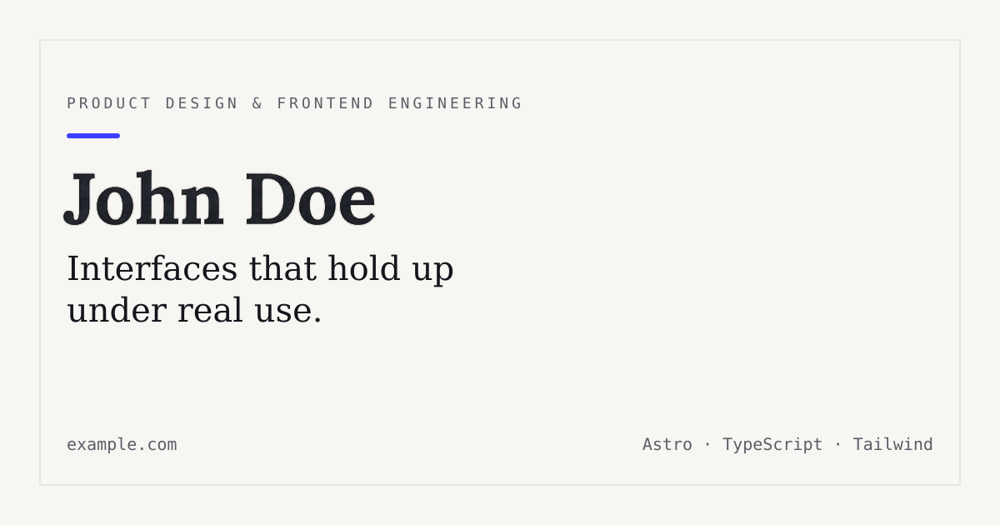

<div align="center">

# Portfolio Starter

A minimal, professional portfolio template for **Astro**. Built for people who want
something that looks intentional on day one, without a component library you didn't ask for.

[**Live Demo**](https://astro-starter-portfolio.vercel.app) · [Report an issue](https://github.com/BracoZS/astro-starter-portfolio/issues)

</div>

<br />

<div align="center">
  
</div>

<br />

## Features

- **Astro 7** — static output, zero client-side JavaScript by default
- **Tailwind CSS v4** — CSS-first config, no `tailwind.config.js` needed
- **Content Collections** with a typed Zod schema — add a project by dropping a Markdown file in `src/content/work/`
- **Light & dark mode** — class-based, no flash of unstyled theme on load
- **Astro Fonts API** — self-hosted Google Fonts, zero layout shift, no third-party requests
- **View Transitions** — smooth navigation between pages
- **SEO defaults done right** — canonical URLs, Open Graph, Twitter cards, auto-generated sitemap
- **Strict TypeScript** — `astro/tsconfigs/strict`, path aliases (`@/components/*`, etc.)
- **Prettier**, pre-configured for `.astro` files and Tailwind class sorting
- One accent color and two font variables control the entire visual identity

Nothing here is decorative. There's no state management, no UI kit, and no CMS integration —
add those yourself if your project actually needs them.

## Quick start

```bash
git clone https://github.com/BracoZS/astro-starter-portfolio.git
cd portfolio-starter
npm install
npm run dev
```

Open `http://localhost:4321`.

| Command           | Action                                             |
| ----------------- | -------------------------------------------------- |
| `npm run dev`     | Start the local dev server                         |
| `npm run build`   | Type-check, then build for production to `./dist/` |
| `npm run preview` | Preview the production build locally               |
| `npm run check`   | Run `astro check` only                             |
| `npm run format`  | Format the project with Prettier                   |

## Project structure

```text
├── public/
│   ├── favicon.svg
│   ├── og-image.png          # replace with your own 1200×630 image
│   └── robots.txt
├── src/
│   ├── assets/               # static images and assets
│   ├── components/           # Header, Footer, Button, WorkRow, ThemeToggle...
│   ├── content/
│   │   └── work/*.md         # one file per project
│   ├── layouts/
│   │   └── BaseLayout.astro  # <head>, SEO, fonts, theme script
│   ├── pages/
│   │   ├── index.astro
│   │   ├── about.astro
│   │   ├── work/[id].astro
│   │   └── 404.astro
│   ├── styles/
│   │   └── global.css        # design tokens + Tailwind import
│   ├── utils/
│   │   └── formatDate.ts     # date formatting helpers
│   ├── content.config.ts     # Zod schema for the "work" collection
│   └── site.config.ts        # name, bio, email, social links
├── astro.config.mjs
└── tsconfig.json
```

## Customizing

**Your info.** Edit `src/site.config.ts` — name, tagline, email, and social links are
read from this one file by the header, footer, and homepage.

**Colors.** Edit the five custom properties at the top of `src/styles/global.css`
(`--paper`, `--ink`, `--ink-soft`, `--signal`, `--line`). Every component reads from
these tokens, so changing them re-skins the whole site.

**Fonts.** Swap the three families in the `fonts` array in `astro.config.mjs`. Any
family available from Google Fonts works — Astro self-hosts it automatically.

**Projects.** Add a Markdown file to `src/content/work/`. Required frontmatter is
enforced by the schema in `src/content.config.ts`:

```md
---
title: Project Name
summary: One sentence, shown in the list view.
role: Your role on the project
date: 2026-01-15
tags: [Astro, TypeScript]
url: https://example.com # optional
repo: https://github.com/... # optional
featured: true # optional, shows it first on the homepage
---

Full write-up in Markdown.
```

**Open Graph image.** Replace `public/og-image.png` with your own 1200×630 image.

## Deploying

This is a static site — it deploys anywhere that serves static files. See Astro's
[deployment guides](https://docs.astro.build/en/guides/deploy/) for
Vercel, Netlify, Cloudflare Pages, and others. Remember to update the `site` value
in `astro.config.mjs` to your real domain before building — it's used for the
sitemap and canonical URLs.

## License

MIT — see [LICENSE](./LICENSE). Free to use for personal or commercial projects,
attribution appreciated but not required.
